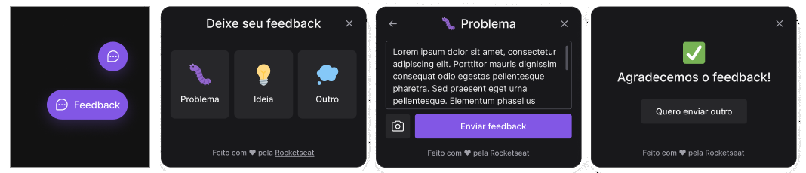
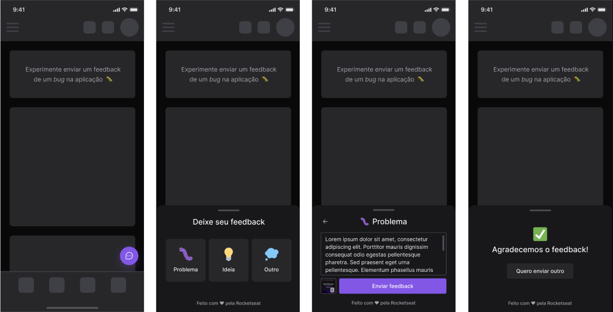

<h1 align="center">
     
    
</h1>

# FeedGet
Projeto desenvolvido na trilha Impulse para coletar feedbacks* Projeto realizado na Next Level Week #8 @Rocketseat. 
<h2>Veja -><a href="https://feedgets.vercel.app/" target="_blank"> DEMO web</a> </h2> 

#### Funcionalidades
* App responsivo e com acessibilidade
* Coleta de feedbacks
* Print da tela 

## Tecnologias 🚀
Esse projeto foi desenvolvido com as seguintes tecnologias:

    
Front-end / web

    <a href='https://reactjs.org'>React | ^18.0.0</a> 
    <a href='https://www.typescriptlang.org'>Typescript | ^4.6.3</a> 
    <a href='https://tailwindcss.com'>Tailwindcss | ^3.0.24</a> 
    <a href='https://vitejs.dev'>Vite | ^2.9.5</a>

    
Back-end / serve

    <a href='https://nodejs.org/pt-br'>Node | 17.7.1</a> 
    <a href='https://www.prisma.io'>Prisma | ^3.13.0</a> 
    <a href='https://www.typescriptlang.org'>Typescript | ^4.6.4</a> 
    <a href='https://jestjs.io/pt-BR'>Jest | ^28.0.3</a> 
    <a href='https://nodemailer.com/about'>Nodemailer | ^6.7.5</a>

    
Mobile / mobile

    <a href='https://expo.dev'>Expo | ~44.0.0</a> 
    <a href='https://reactnative.dev'>React Native | 0.64.3</a> 
    <a href='https://www.typescriptlang.org'>Typescript | ~4.3.5</a> 
    <a href='https://axios-http.com/docs/intro'>Axios | ^0.27.2</a>

## Screenshot 🚧
### Desktop 

    

### Mobile

    

